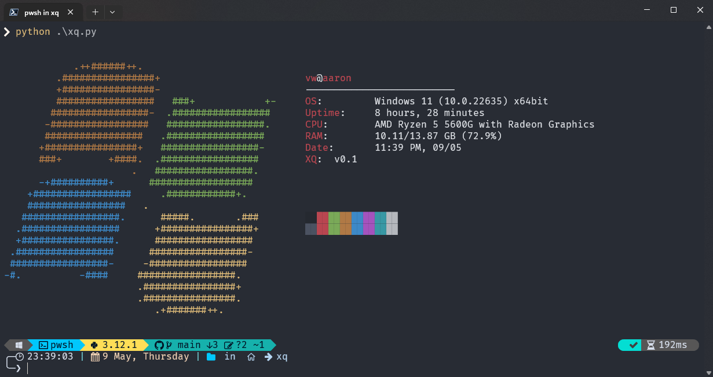

<p align="center">
  <h2 align="center">Xq Fetch</h2>
  <p align="center"></p>
</p>

<p align="center">
  <a>
    
  <a>
    
  </a>
  <a>
    
  </a>
  <a>
    
  </a>
</p>

<p align="center">
  <a href="#instalación">Instalación</a> -
  <a href="#uso">Uso</a>
</p>

Xq Fetch es un script de Python diseñado para recopilar y mostrar información del sistema en la línea de comandos de una manera clara y concisa.

## Características

- Muestra información del sistema, incluyendo OS, CPU, RAM, fecha y tiempo de actividad.
- Permite cambiar el color de la salida para una personalización adicional.
- Opciones para ajustar la configuración de la fecha y la unidad de la RAM.

## Requisitos

- Python 3.x
- Librerías Python: psutil, colorama, py-cpuinfo

## Instalación

1. Clona el repositorio: `git clone https://github.com/aaronwayas/xq.git`
2. Navega al directorio del proyecto: `cd xq`
3. Instala las dependencias: `pip install -r requirements.txt`
4. Ejecuta el fetch: `python xq.py`

Si tienes problemas, puedes contactar con nosotros mediante un issue o un pull request.

### Ejecución automática al abrir una terminal de Windows

Si deseas que el script se ejecute automáticamente cada vez que abras una terminal de Windows, puedes seguir estos pasos:

1. Abre Notepad o cualquier editor de texto.
2. Escribe el siguiente comando, reemplazando ruta_al_script con la ruta completa del script:

```bash
  python ruta_al_script/system_info_fetcher.py
  ```

3. Guarda los cambios y cierra el editor.

Y ahora el script se ejecutará cada vez que abres una terminal de Windows. Cualquier problema que tengas con el script, puedes contactar con nosotros por un issue o un pull request. Te lo agradeciamos por tu ayuda.

## Uso

Ejecuta el script sin argumentos para mostrar la información del sistema:

```bash
python xq.py
```

Opciones adicionales:

- `-d` o `--delete`: Elimina los datos almacenados por el script.
- `-c COLOR` o `--color COLOR`: Cambia el color de la salida. Los colores disponibles son: black, red, green, yellow, blue, magenta, cyan, white.
- `-s SETTING` o `--settings SETTING`: Cambia la configuración del script. Las opciones disponibles son: ram, date.

Ejemplos:

```bash
python xq.py -d
python xq.py -c red
python xq.py -s ram
```

## Screenshots

<details>
<br>
<summary><b>View Screenshots</b></summary <br>  

<p align="left"></p>

</details>

## Contribuyendo

Las contribuciones son bienvenidas. Si encuentras algún error o tienes alguna idea para mejorar el script, no dudes en abrir un issue o enviar un pull request.

## Licencia

Este proyecto está licenciado bajo la [Licencia MIT](https://opensource.org/licenses/MIT).
